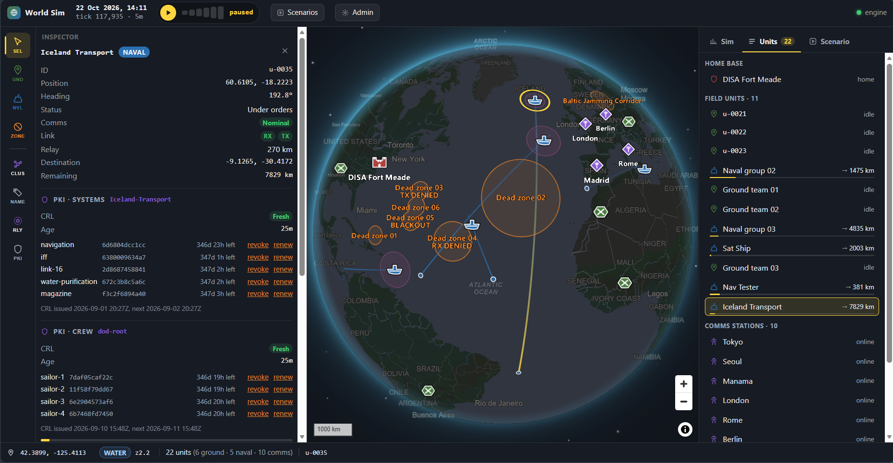

How do you design a strategy game where the failure state is nothing happening?

Certificates expire and get revoked in the background, and the system works because nobody looks at it. When it breaks, it breaks silently. Things keep running while the ground disappears under them. That fits none of the feedback conventions games normally use. No damage numbers, no health bar, no explosion.

So I made a globe you can spin, put ships on it, gave each ship real certificates from real infrastructure, and built the rules for cutting them off.

Solo project: systems design, scenario design, UI, engine. Three scenarios, ten shore stations, sixteen satellites, 458 tests.

## Making "nothing" readable

Each ship carries expiring certificates, one per system, plus the list of what's been revoked. That list is only good for 24 hours and has to be refreshed over the ship's link.

Cut the link and nothing breaks. The ship keeps sailing, keeps taking orders. It just stops knowing things.

Simulating that is easy. It's a timer. The work was building enough around the timer that watching it means something. Three rules I held to: you see the failure coming while you can still act, you can cause it yourself and watch it spread, and the game never tells you something false in a comforting direction.

## Real view using Certificate Authorities

None of the PKI is invented. Point it at existing infrastructure and the ships inherit what's actually issued to them — real lifetimes, real `notAfter` dates, real revocation lists. Cut a ship's link in the sim and it stops fetching, like any disconnected box. What goes stale on the globe really went stale.

That makes it an accessibility tool as much as a game. If you work with this stuff, an expired CRL is a line in a log. If you don't, it's nothing, which is a problem when you need a room to agree that certificate lifetimes matter. A ship still steaming and still trusting things it can't check is something you can point at.

It also meant I couldn't tune the numbers for drama. The lifetimes are whatever they really are, so pacing had to come out of scenario design instead.

## The core loop

Four verbs, and anything a scenario script does, the player can do by hand:

- **Place** ships on water, troops on land. Anything else is rejected with a reason.
- **Order** them around. Routes follow real coastlines and thread through five canals and straits.
- **Jam** an area. Draw a zone, pick what it takes away, watch the network reroute.
- **Watch.** Fast-forward and follow each ship's trust go fresh, aging, expired.

Time runs in five-minute ticks. At 60× a 21-day blackout takes about a hundred seconds, and speeding up changes nothing about the outcome. You just wait less.

Keeping scripted and player actions identical means every scenario doubles as a tutorial. Nothing happens in front of you that you couldn't have done yourself.

## Systems that combine

Each rule is simple on its own. I wanted the interest in how they interact.

**Receive and transmit are separate.** Revocations are broadcast, so only receive decides whether a ship stays current. It can talk all it wants and still go stale.

That gives me the case I built the game around: a ship that transmits but can't receive. Home base keeps hearing from it, so it reads as healthy, and nothing indicates it's going blind. A ship running silent by choice and a ship under an uplink jammer also look identical — same flags, same behaviour. You only know which is which because you remember where you put your jammers.

**Jamming zones stack and never cancel.** A zone is a real cap on the globe, so 900 km means 900 km in the Arctic and at the equator. Some are hard-edged holes; others fade out through a degraded fringe you can work the edges of. Overlap two and things only get worse. That's a design call more than a physical one — it means you can reason about two zones without memorising special cases.

**Links fall back down a ladder.** Each ship takes the best connection available:

| | Link | What you get |
| --- | --- | --- |
| 1–2 | Wideband and commercial satellite | A proper connection |
| 3–4 | Protected and narrowband satellite | Degraded, but protected survives jamming |
| 5 | HF radio | Intermittent, needs a station within 4,000 km |
| 6 | Ship-to-ship relay | Up to three hops through neighbours |

Satellite links need the ship and a shore station under the same satellite, which turns ten fixed points into terrain. Jam the Gulf station and a Gulf ship comes ashore at Rome instead. Jam home base and the whole map drops. Relay chains build themselves out of each ship picking its own next hop, so they stay correct as the middle ships move. There's no global pathfinder anywhere.

**Revocations travel, replacements wait.** A revocation is broadcast, so it finds a ship on its own the next time it can listen. A new certificate isn't. It sits in a queue until the ship turns up. A ship back from a blackout clears its old certificates first, then collects its new ones, and you watch both land in order.

## Scenarios as levels

Scenarios are data — units, zones, scripted beats on the world clock — and tests check each one for illegal placements, missing references and beats out of order. There are three, each aimed at one idea:

- **baseline-blackout** — a destroyer goes dark for 21 days while two others stay in contact as a control group. What lapses.
- **revocation-gap** — the same certificate is revoked on two ships the same day. One hears within the hour, the dark one can't be told. Who gets told.
- **pre-issuance** — two identical destroyers, same outage, one variable changed. Only the one with longer-lived certificates comes back usable. What preparation buys.

The last one is a controlled experiment dressed as a level. Two units, one difference, and the player draws the conclusion.

### DDG-14 *Vanguard*

Dark from day 1 to day 22, carrying three certificates with mismatched lifetimes:

| Certificate | Lifetime | Lapses on |
| --- | --- | --- |
| surface-radar | 120 h | day 5 |
| sonar | 336 h | day 14 |
| satcom | 1440 h | day 60 |

Two days in, the revocation list ages out and reads expired. Day 7, radar passes its `notAfter`. Day 16, sonar goes too, while satcom is still fine after sixty days cut off. Day 19 it's still steaming and still trusting what it can't check. Day 23 it reconnects, the revocation list goes fresh, and the two expired certificates are still expired.

The mismatched loadout does the teaching. A five-day certificate can't survive three weeks of silence and a sixty-day one can't fail to, so one hull comes back holding both outcomes. Scenarios load paused, so the player has the clock before anything happens to them.

## Warn early, never lie

Trust reads **fresh**, then **aging** past halfway, then **expired**. Aging is there so a plan's cost shows up while you can still change it, instead of after the ship is in the dead zone.

That only works if the readout stays honest at speed. Ships refresh on a simulated timer capped at one real request per second, so fast-forward can't hammer the servers. Run fast enough, though, and a well-connected ship starts showing stale data, which is the game lying in the worst direction. 60× is the ceiling where a connected ship still refreshes every five simulated hours against a 24-hour window.

Elsewhere the UI is optimistic and the sim has the last word. Dropping a unit shows an instant land-or-water guess; the sim's coastline check decides. Movement renders at 60 fps off one update a second because the client runs the same path function instead of interpolating blind. Rejections come back as a toast with a reason.

## The stack

**Headless Unity runs the simulation** — tick loop, spatial queries against coastline and zone geometry, route search over the world grid. Headless means the same binary drives the client, the tests and batch runs, so there's one implementation of the rules.

**C#/.NET services sit in front of it** and handle anything touching real infrastructure: the CA, revocation list fetching and caching, the delivery queue for reissued certificates, and the request cap. The sim decides whether a ship can reach the network; the services decide what's there when it does.

**The client is React with deck.gl over MapLibre.** deck.gl does the globe projection and the overlays — arcs for network paths, caps for jamming zones, the satellite shells. MapLibre handles the basemap. The client keeps its own copy of the path function for smooth movement.

**SQLite** holds scenario definitions and run state. Single file, single player.

**458 tests** cover link resolution, zone stacking, route legality and certificate state transitions, plus validation across every scenario. They're cheap to run, and they're why I could keep changing rules late.
